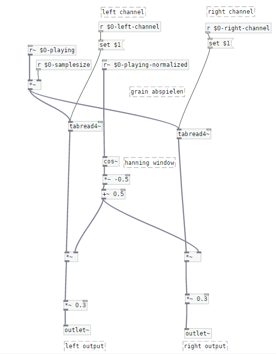
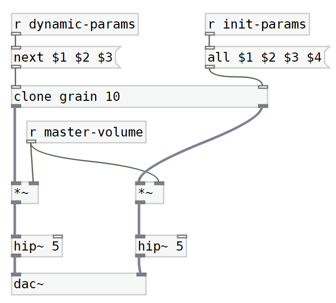

# Granny Synth

Adrian Ludwig
 Im Sack 11
 86152 Augsburg
 +49 157 71704314

hello@adrianludwig.de

Codrin Podoleanu

2rd author's affiliation
 1st line of address
 2nd line of address
 Telephone number, incl. country code

codrin.podoleanu@hs-augsburg.de

#### Abstract

GrannySynth ist ein Prototyp für ein Hard-/Softwaresystem für Granularsynthese in Echtzeit für Liveperformances und Sounddesign. Er enstand 2020 im Kurs "Interaktion/Programmierung" bei Prof. Dr. Thomas Rist an der Hochschule Augsburg. Eine Videodemonstration des Systems finden Sie hier.

 #### Klassifizierung und Einordnung

C.3 [SPECIAL-PURPOSE AND APPLICATION-BASED SYSTEMS] *,* H5.5 [SOUND AND MUSIC COMPUTING], [H.5.2](http://www.acm.org/about/class/ccs98-html#H.5.2) [USER INTERFACES]

#### General Terms

Design, Experimentation, Soundsynthesis

#### Keywords

Granularsynthese, Raspberry Pi, Pure Data, Liveperformance

#### 1. Motivation

##### Problemstellung: Granulare Synthese 

Wir interessieren uns für das Feld des Sounddesigns und suchen nach neuen Mitteln für Klanggestaltung. Eine sehr vielseitige Möglichkeit Klänge zu Formen ist die sogenannte "Granularsynthese". Vor allem in der Improvisation lassen sich mit dieser Syntheseart stark eigenständige, eindrucksvolle Klänge erzeugen.

Da es sich um eine digitale Syntheseart handelt, gibt es bereits ein Vielzahl an Software-Synthesizern. Diese eignen sich für die Liveperformance nur bedingt, benötigen sie doch immer einen Rechner mit einer entsprechenden DAW. Vor allem in der Außenwahrnehmung durch Publikum entsteht dabei häufig der Eindruck, dass weniger Live auf der Bühne geschieht, als dass vieles vom Rechner abgespielt wird. Diese Wahrnehmung ist verständlich, sieht es manchmal doch tatsächlich so aus, als würde man seine Mails checken, wenn man angestrengt auf einen Bildschirm sieht. 

Ziel von Granny Synth ist es, dieses Problem zu beseitigen, indem auf Basis eines Kleinstrechners und geeigneter Interfacegestaltung ein Liveperformance-geeigneter Granularsynthesesystem gestaltet wird.

Dieses Paper beschreibt die Erstellung eines Prototypen des Systems "Granny Synth". Folgende Schritte werden im folgenden durchlaufen:

- Motivation

- Verwandte Arbeiten

- Anwendungszenarion

- - Anwendungsfall allgemein
  - Konkreter Anwendungsfall

- Entwurf des Prototyps

- - Technischer Ansatz
  - Konzeptueller Aufbau des Prototypen

- Implementierung

- - Hard- und Softwareumgebung
  - Kern der Implementierung
  - Umfang des Prototypen

- Evaluation

- - Ziele der Evaluation und Methodik
  - Durchführung der Evaluation
  - Interpretation der Evaluationsergebnisse

- Zusammenfassung

- - Erzielte Ergebnisse
  - Erweiterungsmöglchkeiten

#### 2. Verwandte Arbeiten

Wie in der Motivation beschrieben, gibt es bereits eine Vielzahl von Softwarelösungen für Granulare Synthese. Ein Prominentes Beispiel ist der in Ableton Live (Digital Audio Workstation) verfügbare "Granulator" https://www.monolake.de/technology/granulator.html

Diese Implementierung der Granularsynthese besticht durch eine vielzahl von Parametern und eine Verhältnismäßig einfache Bedienbarkeit. Dazu trägt insbesondere das sinnvoll gestaltete Bedieninterface entscheidend bei. 

In der Welt der Hardware finden sich vergleichsweise wenig Implementierungen von brauchbarer Granularsynthese. Am häufigsten noch sind Lösungen im Bereich der Modularen Synthesizersysteme zu finden. Ein prominentes Beispiel hier ist Mutable Instruments "Clouds" Eurorack-Modul. https://mutable-instruments.net/modules/clouds/ Hier besteht das Problem, dass man darauf angewiesen ist, ein entsprechendes Rack mit allen weiteren nötigen Modulen aufzubauen. Das ist aufwändig und vor allem teuer.

Ein System, das aufgrund seines Aufbaus viele Arten der Synthese zulässt, indem es auf die Open Source Software "Pure Data" zurückgreift, ist Critter and Guitaris "Organelle". https://www.critterandguitari.com/organelle Dabei kommt es auf die Community an, die neue Patches auch frei zur Verfügung stellen kann. Dieses System funktioniert sehr gut, ist aber Aufgrund kleiner Auflagen eher teuer.

Aufgrund dieser vorhergehenden Arbeiten soll mit "Granny Synth" eine Lösung für entscheidende Probleme der genannten Beispiele geschaffen werden. 

Der Klangerzeugungsaufbau und die Modulationsparamter des Granulator dienen als Grundlage zur Gestaltung der Softwareseite.

Als Basis für das System soll - wie bei Critter and Guitaris "Organelle" ein Raspberry Pi und Pure Data dienen. Im Gegensatz zur Organelle setzen wir explizit auf granulare Synthese, sowie auf niedrigere Kosten.

#### 3.Anwendungsszenario & Use Case

##### 3.1 Portabler Granularsynthesizer

2. Entwicklung eines portablen, preiswerten Granularsynthesizers. Nutzer:innen sollen mit dem Gerät ein          flexibles,  Portables Gerät für die Liveanwendung von Granularsynthese zur Hand haben. 

##### 3.2 Definition der Use Cases

2. Die wichtigsten Uses Cases werden im Folgenden erläutert.

###### 	3.2.1 Hardwaresystem für Granularsynthese

Ein:e Nutzer:in benutzt das System um einen Granularen Synthesizer zu steuern. Dafür werden die eingesetzten Hardwarekomponenten zur Kommunikation zwischen Akteur und Hardwaresystem genutzt. 
  - User dreht Encoder im Uhrzeigersinn: 
       nkrement eines Parameterwertes

  - User dreht Encoder gegen Uhrzeigersinn: 
       ekrement einesParameterwertes

  - User drückt Encoder nach unten: 
       odus des jeweiligen Encoders wird ausgewählt

###### 3.2.2 Modulares Hardwaresystem zur Bedienung von Pure Data 

Ein:e Nutzer:in definiert ein eigenes Pure Data Patch, das über die vorhandene Hardware gesteuert werden kann. Hierfür muss die Nutzer:in eine entsprechende Konfigurationsdatei für die Hardware, sowie ein „Pure Data“- Patch anlegen.

#### 4. **Entwurf des Prototyps**

##### 4.1 Technischer Ansatz

2. Das Gerät basiert auf der Hardwareseite aus einem Raspberry-pi 3, Fünf Ky-040 Drehencodern, sowie einem 20x4 Zeichen LCD Display. Die Komponenten befinden sich in einem einfachen, aus Holz gefertigten Gehäuse.
    Zur Verarbeitung der IO-Befehle verwenden wir python und die zum Raspberry korrespondierende python Library RPi.GPIO. 
    Als System für die Granularsynthese verwendet das System die Open Source Software „Pure Data“. 
    Die Kommunikation zwischen GPIO und Pure Data erfolgt über das OSC-Protokoll.

##### 4.2 **Konzeptueller Aufbau des Prototypen**

1. Das System besteht aus mehreren, miteinander kommunizierenden Untersystemen. 

2. Beschreiben Sie hier aus welchen Systemkomponenten Ihr Prototyp besteht, welche Schnittstellen Sie zwischen den Komponenten festlegen. Evtl. ist es sinnvoll, weitere Unterpunkte zu bilden, etwa zur Beschreibung eines „Servers“ und eines „Clients“ oder zwischen „Sensorik“ und „Steuerung“ usw., je nachdem, welche Komponenten Ihr Konzept umfasst.

###### 4.2.1 GPIO - Server

Die Verarbeitung der Sensordaten erfolgt über einen GPIO-Server, der die entsprechenden Inputs und Outputs überwacht. Er empfängt die Signale von Encodern und Display und handlet die Ausgabe von Daten an das Display.

###### 4.2.2 OSC-Client

Die Kommunikation der GPIO Signale zur Audioverarbeitungssoftware erfolgt über einen OSC-Client.

###### 4.2.3 OSC-Server

In der Umgebung des Klangerzeugers empfängt ein Server die über OSC Übertragenen Befehle zur Kontrolle des Klangerzeugers.

###### 4.2.4. Klangerzeuger/Granularer Synthesizer

Die Audioverarbeitung erfolgt über eine eigene Sofware, in diesem Fall „Pure Data“.
Innerhalb der Software wird ein „Patch“ für die Granularsynthese angefertigt. Die Steuerung erfolgt über OSC. Das Programm steuert auch die Audioausgabe auf dem Gerät.* 

Beachten Sie, in diesem Abschnitt sollten Sie weitgehend von Implementierungsdetails abstrahieren. Diese bündeln Sie in einem separaten Abschnitt

#### 5. Implementierung

##### 5.1. Hard- und Softwareumgebung

###### Hardware

- 5 x KY-040 Drehimpulsgeber
- 1 x 20x4 LCD-Display
- 1 x IC2 Adapter
- 1 x kurzes Breadboard
- 1 x Breakout-Adapter Rasperry pi
- 1 x Raspberrry Pi 3 B

Auf dem Raspberry Pi läuft das Debian-basierte Linux-Betriebssystem Raspbian. Als Sprache für die IO-Kommunikation wird Python genutzt. Folgende Libraries werden dafür verwendet:

###### Software

**Pure data**

Die Granularsynthese wurde in *Pure Data* umgesetzt. Pure data ist eine visuelle Programmiersprache, die Musiker, Künstlern und Forschern die Möglichkeit gibt Software zu entwickeln, ohne Code zu schreiben. Stattdessen werden Patches (Programme in Pure Data) durch das platzieren und verbinden von Objekten ersellt.

Wir haben die Pure Data Distribution *pd-L2ork* alias *Purr-data* verwedent, die ein verbessertes GUI und eine Vielzahl von nützlichen Bibliotheken enthält.

**Python**

Die Kommunikation zwischen den verscheidenen Komponenten geschiet über ein Python Programm, das wir geschrieben haben. Python ist eine Allzweck-Programmiersprache, die über eine Vielzahl von internen sowie externen Bibliotheken verfügt.

Folgende Bibliotheken haben wir benutzt:

- [RPi.GPIO](https://pypi.org/project/RPi.GPIO/)
- [ADAFRUIT_LCD1602](https://github.com/amusarra/raspberry-pi-access-via-ts-cns/blob/master/modules/Adafruit_LCD1602.py)
- [PCF857](https://github.com/amusarra/raspberry-pi-access-via-ts-cns/blob/master/modules/PCF8574.py)
- [KY040](https://github.com/martinohanlon/KY040/blob/master/ky040/KY040.py)
- [python-osc](https://pypi.org/project/python-osc/)
- sowie *math*, *threading*, *argparse* und *os* aus der Standardbibliothek

Beschreiben Sie hier kurz Ihre Entwicklungsumgebung (Hardware, Betriebssystem, Programmiersprachen / Bibliotheken, eingesetzte Tools etc.). Evtl. können Sie hier auch noch auf die Entwicklungsmethode eingehen, etwa, wenn Sie verschiedene Testaufbauten gemacht haben, die letztlich zum finalen Prototypen geführt haben.

##### 5.2  Kern der Implementierung

1. Ein großer Teil der Arbeit war die Anfertigung des Pure Data Patches für die Granularsynthese, sowie die Kommunikation zwischen GPIO des Raspberry Pi und Pure Data.
2. Dabei war eine besondere Herausforderung das Einrichten des Betriebssystems und der Selbst erstellten Software, sowie die Modularisierung der Eingabe. Das System sollte so flexibel wie möglich bedienbar sein. Die Dreh/Switch-Encoder sollen so viele Parameter wie möglich zugänglich machen.. 

Softwareseitig ist der funktionelle Kern von GrannySynth die Implementierung der Granularsynthese als Pure Data Patch.

Der Subpatch *grain* beinhaltet die Referenz zum geladenen Audiosample sowie die Funktionalität das Sample zu lesen. Welcher Teil des Samples und wie schnell es gelesen wird, hängt von Variablen ab, die der Subpatch als Eingangsparameter bekommt.

Im Haupt-Patch *granny-synth* wird das Audiosample geladen, Parameter initialisiert sowie die OSC-Nachrichten, die die Parameterveränderungen beinhalten, empfangen und gespeichert. Der Patch liest das Sample kontinuierlich durch. Die gescannte Position des Samples, sowie die Parameter Länge und Tonhöhe, werden an die *grain* Objekte weitergeben, wenn ein Triggersignal gegeben wird. Dies hängt vom Parameter *Dichte* ab, der bestimmt wie oft ein neues Grain gestartet wird (es handelt sich hier einfach um die Frequenz eines Oszillators, der bei jeder Phase das Triggersignal gibt). Schließlich wird der Signalausgabe aller Grains gemischt und am Endgerät ausgegeben.

##### 5.3 Umfang des Prototypen

1. Der Umfang des Prototypen beschränkt sich auf ein Proof of Concept. Dabei funktioniert das Laden eines Samples für die Granularsynthese, sowie die Steuerung der wichtigsten Parameter über die Encoder.

**5.3.1 Implementiert**

Die grunsätzliche Funktionalität ist vorhanden. Die Drehregler können bedient werden, um damit Parameter in Pure Data Patch zu verändern. Durch einen fünften Drehregler kann zwischen mehreren Modi gewechselt werden. Es wurden zwei Modi (Parameter der Granularsynthese und Settings) implementiert. Das Display liefert visuelles Feedback in echtzeit.

**5.3.2 Nicht Implementiert**

Das wohl größte fehlende Feature ist die Ansteuerung des Synthesizers durch MIDI ähnlich wie im *Granulator II* von Monolake

Eine Effekt-Kette mit Filter, Delay und Reverb fehlt auch.

Außerdem fehlen LFOs als Modulationsquellen für die Parameter der Granularsynthese.

#### 6. Evaluation

##### 6.1 Ziele der Evaluation und Methodik

Ziel der Evualtion ist feszustellen, ob die Bedienung, ein vorhandenes Grundverständnis der Granularsynthese vorrausgesetzt, intuitiv und leicht-erlernbar gestaltet ist. Aber auch ist die technische Leistungsfähigkeit des GrannySynth soll evaluiert werden.

Als Gesamtziel der Evaluation ist vornehmlich festzustellen, ob das System als eigenständiges Hardwaresystem für Granularsynthese funktioniert. 

Die Leistungsfähigkeit kann durch einen schlichten Lasttest erfolgen. Dazu werden die implementierten Parameter auf bzgl. der Systemperformance auf ihre Grenzbereiche eingestellt. Sollten audio Artefakte wie Klick auftauchen, ist GrannySynth überlastet.

Dazu sollten eine Vielzahl von Permutationen der Werte von Grainlänge, Graingröße, Graindichte sowie Grainanzahl getestet werden.

(Darüber hinaus werden weitere Klangformungsmöglichkeiten implementiert, um das System „Livetauglich“ zu machen. Dazu gehören verschiedene Effekte wie bspw. ein Filter und Reverb.)

Anschließend werden Usertests durchgeführt, um bisher unentdeckte Fehler und Probleme festzustellen. Die User bekommen keine Anweisungen zur Nutzung (z. B. "erstelle aus diesem Sample möglichst vielfältige Varianten") des Systems und füllen nach einer Testzeit von 30 Minuten einen Fragebogen aus. Die Fragen werden mit einer Bewertung auf einer Skala von 1-10 beantwortet. Folgende Fragen sieht der Fragebogen vor:

- Wie bewerten Sie das visuelle Feedback des GrannySynth?
- Wie bewerten Sie die Bedienung des GrannySynth?
- Wie bewerten Sie die Klangqualität des GrannySynth?
- Wie bewerten Sie die Live-Tauglichkeit des GrannySynth? 
- Inwieweit konnten Sie gezielt Klänge nach Ihrer Vorstellung gestalten?

Zusätzlich können User in einem "Sonstiges"-Feld frei schriftliche Angaben zu Punkten machen, die Ihnen auffallen.

(Je nachdem, worauf Ihre Studie abzielt, können Sie z.B. daran interessiert sein, ob Ihre Technik überhaupt nutzbar ist (d.h., kommen Nutzer damit zurecht oder kommt es häufig zu Fehlbedienungen). Das finden Sie z.B. heraus, wenn Sie Testpersonen mit Ihrem System arbeiten lassen.

Wollen Sie hingegen nachweisen, dass Ihr System besser ist, als ein bereits existierendes, so können Sie einen Systemvergleich anstellen. )

##### 6.2. Durchführung der Evaluation

Eine Evaluation des Systems mit mehreren User:innen war in der aktuellen Situation bisher nicht möglich. Die Usertests beschränken sich somit auf die Erfahrungen der Entwickler.

##### 6.3. Interpretation der Evaluationsergebnisse

Mangels objektiv evaluierbarer Ergebnisse  über die Erfahrungen der Entwickler hinaus entfällt eine Interpretation der Evaluationsergebnisse.

Beim Lasttest des GrannySynth ist festzustellen, dass eine Grainanzahl über 10 zu Artefakten führt.

Die doch sehr beschränkte Grainanzahl ist wohl auf bestimmte Rechnungen im *grain* Subpatch zurückzuführen, die die Leistung bei einer höheren Anzahl von Grains strapaziert.

Es sollten alle unnötigen Rechnungen entfernt oder ausgelagert werden.

#### 7.Zusammenfassung

Hier fassen Sie nochmal kurz zusammen, was Sie gemacht haben und welche Erkenntnisse aus Ihrer Arbeit hervorgegangen sind. Es bietet sich eine Gliederung an in die Teilabschnitte „Erzielte Ergebnisse“ und. „Ausblick“.

##### 7.1. Erzielte Ergebnisse

Wir haben ein Konzept für GrannySynth in Hinblick auf ein flexibles Hybrid-Synthesizer System entwickelt, dass sich durch analoge Bedienung und digitaler Klangerzeugung auszeichnet.

Wir erstellten einen Pure Data Patch, der Granularsynthese implementiert und OSC-Signale empfängt. Ein Python Programm, dass wir geschrieben haben, verarbeitet den Input und ist für die Kommunikation zwischen den Komponenten verantwortlich.

Wir haben die Hardware in ein Gehäuse verbaut, dass hinsichtlich des Status als Prototyp noch Veränderungen zulässt. Auf unserem Raspberry Pi wurden die Systemkonfigurationen passend eingestellt.

##### 7.2. Erweiterungsmöglichkeiten / Ausblick

Aus den fehlenden Implementierungen aus **5.3** sind die zusätzlichen Parameter der Effektkette wohl am einfachsten zu implementieren. Außerdem sollte ein config file erstellt werden, dass die Anpassung und Veränderung in Zukunft vereinfachen soll.

#### **Referenzen**

1. Implementing Real-Time Granular SynthesisRoss BencinaDraft of 31st August 2001 http://www.rossbencina.com/static/code/granular-synthesis/BencinaAudioAnecdotes310801.pdf
2. Granular Synthesis - How It Works & Ways To Use It - Simon Price, December 2005 https://www.soundonsound.com/techniques/granular-synthesis
3. Granulator II - Robert Henke - https://roberthenke.com/technology/granulator.html
4. Granularsynthese mit Pure Data - http://www.pd-tutorial.com/german/ch03s07.html
5. Pythonosc - https://pypi.org/project/python-osc
6. Python GPIO https://www.raspberrypi.org/documentation/usage/gpio/python/README.md
7. Raspberry Pi and realtime, low-latency audio - https://wiki.linuxaudio.org/wiki/raspberrypi
8. Granular Synthesis - http://www.sfu.ca/~truax/gran.html